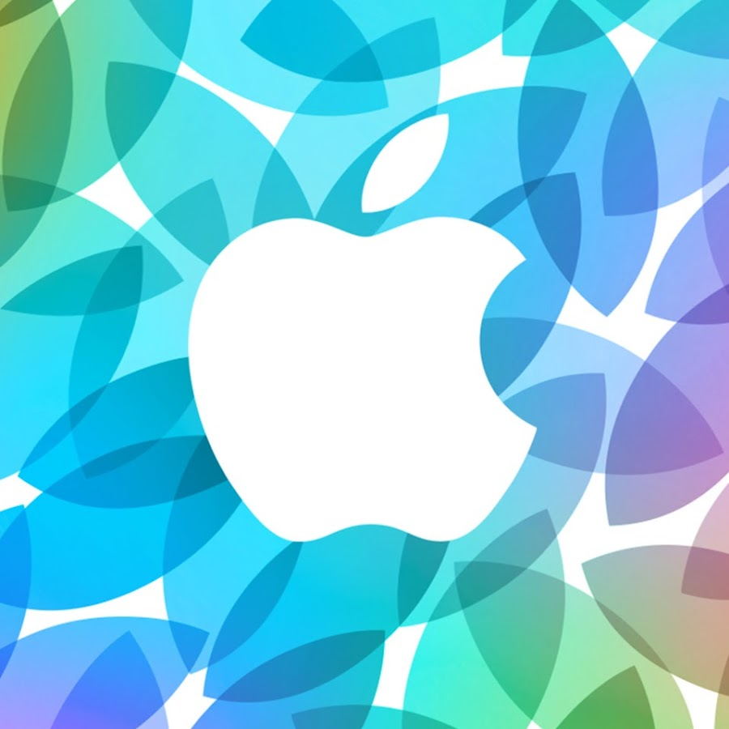

# Oksana Stafeeva
**Oksana Stafeeva** - студентка Нетологии, курс "iOS-разработчик". Параллельно мама в декрете, планирующая после декрета сменить профессию.

## План обучения на Нетологии:
### 1. Основы Swift:
* Playground. Переменные и константы. Числовые и строковые типы;
* Логические типы. Преобразование типов. Условные конструкции;
* Опциональные типы и преобразование;
* Коллекции: массив;
* Словарь. Обход по коллекциям на примере for-in. Кортеж и множество;
* Функции и области видимости.

### 2. Основы Swift advanced:
* ООП;
* Типы объектов. Взаимодействие объектов;
* Наследование. Переопределение;
* Протоколы и расширения;
* Как создавать свои ошибки.

### 3. Git — система контроля версий.

### 4. iOS-dev: интерфейс приложения:
* Дизайн и пользовательский интерфейс;
* Инструменты для разработки интерфейса;* 
* Навигация в iOS и жизненный цикл UIViewController;
* Базовые UI компоненты;
* Верстка экранов для iOS. Auto Layout;
* UITableView, UIScrollView, datasource и delegate;
* CollectionView;
* Жесты и анимация;
* Xcode debugging.

